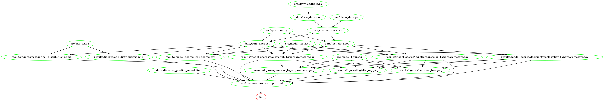

# Diabetes Predictor

- contributors: Heidi Ye, Gurdeepak Sidhu, Marc Sun, Kevin Shahnazari

Demo of a data analysis project for DSCI 522 (Data Science workflows); a course in the Master of Data Science program at the University of British Columbia.

## About
```{r setup, include=FALSE}
knitr::opts_chunk$set(echo = FALSE)
library(knitr)
library(kableExtra)
library(tidyverse)
library(reticulate)
```

```{python libraries, include = FALSE}
import pandas as pd

```

```{python load data}
diabetes = pd.read_csv("data/raw_data.csv")

# Drop first unnamed column
diabetes = diabetes.iloc[:, 1:]
# Clean column names
diabetes.columns = diabetes.columns.str.replace("\s+", "_")
diabetes.columns = diabetes.columns.str.replace("\s+", "_").str.lower()
```

```{r model , message= FALSE, warning = FALSE}
f1 <- read_csv("results/model_scores/test_scores.csv") 
f1 <- f1 %>% arrange(-f1_score) 
f1$model_name[1:3] <- c("Logistic Regression", "Decision Tree", "Gaussian NB")

colnames(f1) <- colnames(f1) %>% str_to_title() %>% str_replace_all("_"," ")
```

We attempt to build three classification models, namely logistic regression, decision tree, and Naive Bayes model which can use the predictors from the diabetes dataset to predict for our positive class of having Diabetes. We compare the model predictive ability based on the f1 score. The logistic regression model performs the best with a mean f1 score of approximately `r round(f1$"F1 score"[1],2)`. The two other models perform well with f1 scores of `r round(f1$"F1 score"[2],2)` and `r round(f1$"F1 score"[3],2)` for the decision tree and Naive Bayes respectively. The precision score is very satisfying, it shows that the model has the ability to eliminate most non-diabetes cases, which helps to save a lot of time in real life situations.

The dataset used for the analysis in the project is based on medical screening questions from the patients of Sylhet Diabetes Hospital in Bangladesh collected by M, IslamEmail, Rahatara Ferdousi, Sadikur Rahman and Yasmin Bushra [@Islametal]. The dataset was sourced from the UCI Machine Learning Repository [@Dua2019] specifically [this file](https://archive.ics.uci.edu/ml/machine-learning-databases/00529/diabetes_data_upload.csv). There are `r nrow(py$diabetes)` observations in the data set, and `r ncol(py$diabetes)` features. There are no observations with missing values in the data set. The number of observations in each classes are shown in the table below.

```{r class counts}
kable(summarise(py$diabetes,
                `Positive Diabetes` = sum(class  == "Positive"),
                `Negative Diabetes` = sum(class  == "Negative")),
      caption = "Table 1. Counts of observation for each class.")
```

## Report
The final report can be found [here](http://htmlpreview.github.io/?https://raw.githubusercontent.com/UBC-MDS/DSCI522-2020-g22/main/docs/diabetes_predict_report.html).

## Usage

There are two suggested ways to run this analysis:

#### 1. Using Docker (recommended)
*note - the instructions in this section depends on running this in a unix shell either Git Bash or terminal*


To run this analysis using Docker, clone/download this repository, use the command line to navigate to the root of this project on your computer, and then type the following (filling in PATH_ON_YOUR_COMPUTER with the absolute path to the root of this project on your computer).

```
docker run --rm -v PATH_ON_YOUR_COMPUTER:/home/data_analysis_eg ttimbers/data_analysis_pipeline_eg make -C '/home/data_analysis_eg' all
```

To reset the repo to a clean state, with no intermediate or results files, run the following command at the command line/terminal from the root directory of this project:

```
docker run --rm -v PATH_ON_YOUR_COMPUTER:/home/data_analysis_eg ttimbers/data_analysis_pipeline_eg make -C '/home/data_analysis_eg' clean
```

#### 2. Without using Docker

1. Make sure you've installed all of the dependencies listed in the Dependencies section below.
1. Download or clone this repository.
1. Open a terminal session and navigate to the root of the project directory.
1. Run the analysis with the following command:

`make all`

To reset the repo to a clean state, with no intermediate or results files, run the following command at the command line/terminal from the root directory of this project:

`make clean`


## Makefile dependency map
Please consider the following dependency map for the make processes for the make file.

```{r}

```

## Dependencies
- Python 3.8.3 and Python packages:
  - pandas==1.1.1
  - scikit-learn==0.23.2
  - docopt==0.6.2
  - matplotlib==3.3.3
- R version 3.6.1 and R packages:
  - knitr==1.26
  - docopt==0.7.1
  - tidyverse==1.3.0
  - ggridges==0.5.2
  - ggthemes==4.2.0
  - ggplot2==3.3.2
  - stringr==1.4.0
  - caret==4.0.3
  - reticulate==1.18
- GNU make 4.2.1
  
## License
The Diabetes Analysis material here are licensed under the MIT LICENSE. Anyone can't publish this repository as their own work and should give credit to the contributors of the project if the results of this project are being used.

# References
