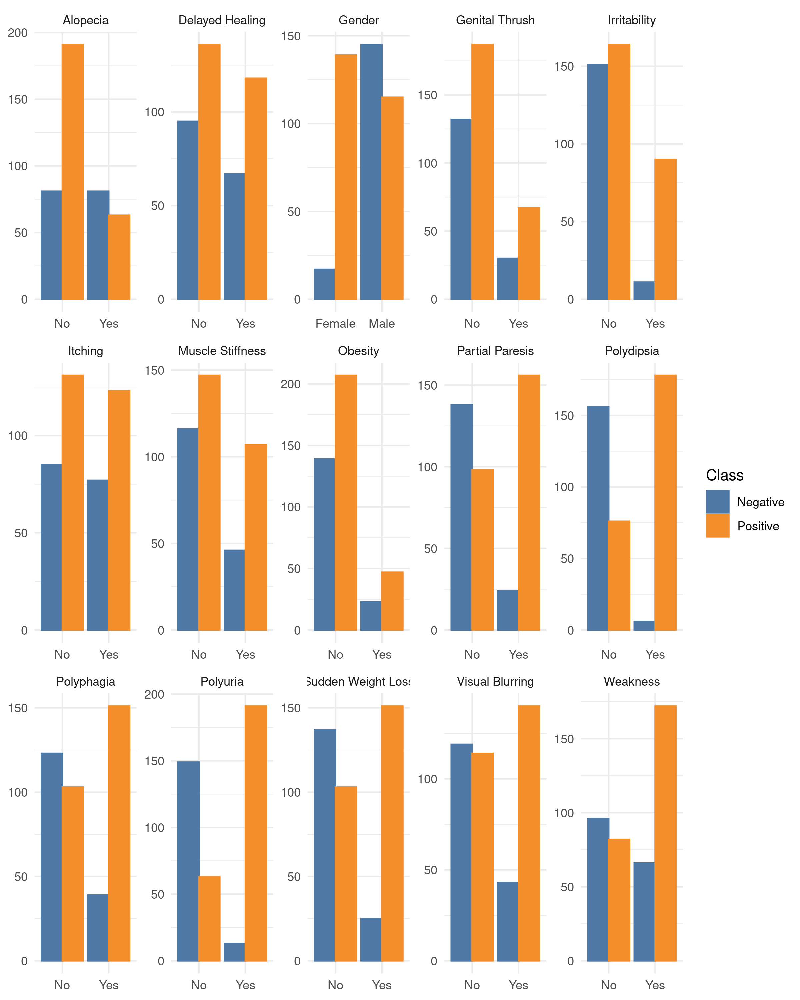
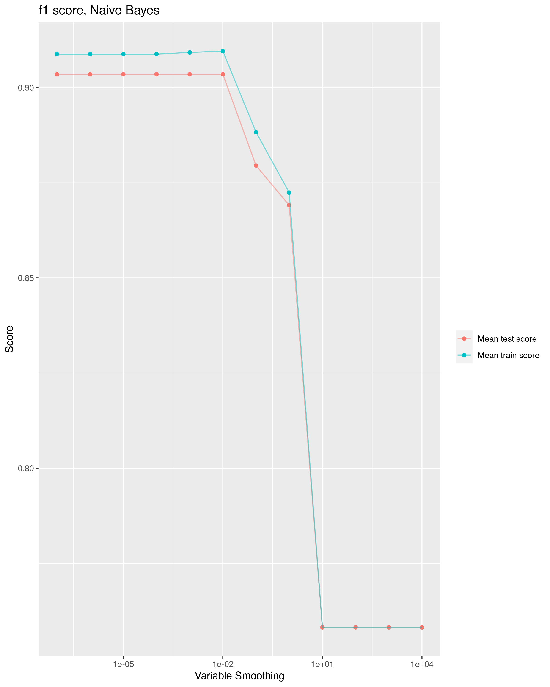

```{r setup, include=FALSE}
knitr::opts_chunk$set(echo = FALSE)
library(tidyverse)
library(knitr)
```

# Summary

Here we apply three different classification models, decision tree, Gaussian Naïve Bayes and logistic regression to predict whether a patient has diabetes given features such as age, gender and any other existing conditions. The objective is to find the model that scores the highest f1 score for our target of having diabetes.

Our analysis shows that all three models performed well on an unseen test data set. The logistic regression model has the highest f1 score (defined by : $2\frac{precision*recall}{precision+recall}$) which is 0.97. The corresponding precision and recall are also 0.97. The two other models also performed well but have slightly lower scores than the logistic regression model. Based on these results, we can conclude that the logistic regression model is the optimal model for this classification problem.

# Introduction

There are currently over 425 million people living with diabetes. With this number on the rise, and many cases going undiagnosed, it is increasingly crucial to be able to predict a diagnosis at an early stage for intervention.

A machine learning model that predicts whether a person has diabetes enables doctors to quickly identify and inform potential candidates that need to begin blood sugar testing. A simplistic and interpretable model can serve as a simple at home self-diagnosing method or help guide doctors on common traits that predict diabetes.

# Methods

[python]

## Data

The dataset used for the analysis in the project is based on medical screening questions from the patients of Sylhet Diabetes Hospital in Bangladesh collected by M, IslamEmail, Rahatara Ferdousi, Sadikur Rahman and Yasmin Bushra. The dataset was sourced from the UCI Machine Learning Repository and can be found in here specifically this file.

The data used for the project is collected by Sylhet Diabetes Hospital, by using direct questionnaires. The data set was sourced from the UCI Machine Learning Repository (Dua and Graff 2017) and can be found here. Each row of the dataset contains answers to common medical screening questions, and the last column indicates whether the patient has diabetes. This is the response variable and the target we intend to predict on.

## Analysis

The code used to perform the analysis and create this report can be found here: <https://github.com/UBC-MDS/DSCI522-2020-g22>

# Exploratory Data Analysis

Our exploratory data analysis indicates that we have 16 features and 520 observations. With the exception of age, which is a numeric feature, the remaining are binary and categorical in nature. Since there is no missing data, the main transformations that are required is one hot encoding for the category features and scaling for the numeric features.

With 320 observations in the positive class (has diabetes) and 200 observations in the negative class, there doesn't appear to be any severe class imbalance in the data. The plots below break down the distribution of positive and negative classes by feature. Again, there is no severe class imbalance by any one feature which would influence how we train our model.



# Result & Discussion

Once the data is split 80% for training and 20% for testing respectively, it is trained on three models: decision tree, Naive Bayes and logistic regression. The hyperparameters used to tune in the validation process are summarized below:

[insert table with each model and hyperparameters used]

The optimal hyperparameters for each model and their corresponding training and validation scores can be seen in the plots below.

  

```{r Results, message= FALSE, warning = FALSE}
decisiontree <- read_csv("../results/model_scores/decisiontreeclassifier_hyperparameters.csv") %>%   
  select(mean_fit_time,	params,mean_test_score,rank_test_score,mean_train_score)%>% 
  arrange(rank_test_score)
kable(decisiontree,caption = 'Table 1')

gaussiannb <- read_csv("../results/model_scores/gaussiannb_hyperparameters.csv")%>%   
  select(mean_fit_time,	params,mean_test_score,rank_test_score,mean_train_score)%>% 
  arrange(rank_test_score)
kable(gaussiannb,caption = 'Table 2')

LR <- read_csv("../results/model_scores/logisticregression_hyperparameters.csv")%>%   
  select(mean_fit_time,	params,mean_test_score,rank_test_score,mean_train_score)%>% 
  arrange(rank_test_score)
kable(LR,caption = 'Table 3')

f1 <- read_csv("../results/model_scores/test_scores.csv")
kable(f1,caption = 'Table 4')
```

We can conclude from the plots above that the most optimal hyperparameter for the decision tree is {max\_depth: 8,min\_samples\_leaf= 1}, for Naive Bayes is var\_smoothing=0.0001 and for logistic regression is {C= 10, solver = 'liblinear'}.

## Conclusion

Finally, we score each of our models on the f1 score and the results are as follows:

```{r model comparison, message= FALSE, warning = FALSE}

f1 <- read_csv("../results/model_scores/test_scores.csv")
kable(f1,caption = 'Table 4')
```

We can see that the logistic regression performs the best with a mean f1 score of approximately 0.97. The two other models perform well with f1 scores of 0.93 and 0.91 for the decision tree and Naive Bayes respectively.

The precision score is very satisfying, it shows that the model has the ability to eliminate most non-diabete cases, which helps to save a lot of time in real life situations.

## Future directions:

Although the analysis above indicates that the logistic regression is the best model for this dataset, there are a few improvements that can still be made. Can we optimize fit and score time through feature selection without compromising on model accuracy? Can we make soft predictions instead of hard predictions so that patients have an understanding of their likelihood being diagnosed? Can we perform further analysis to understand the error rate in our training model? Can we decrease the threshold for predicting positive classes to improve recall scores?

# References
