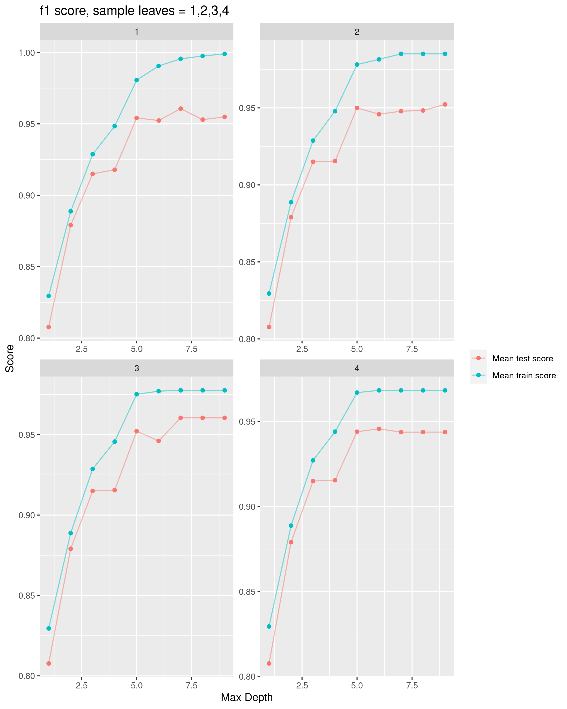

Predicting diabetes from patient’s health information
================
Sicheng Marc Sun, Heidi Ye  
11/28/2020

-   [Summary](#summary)
-   [Introduction](#introduction)
-   [Methods](#methods)
-   [Data](#data)
-   [Analysis](#analysis)
-   [Exploratory Data Analysis](#exploratory-data-analysis)
-   [Result & Discussion](#result-discussion)
    -   [Decision Tree Hyperparameter
        Tuning](#decision-tree-hyperparameter-tuning)
    -   [Naive Bayes Hyperparameter
        Tuning](#naive-bayes-hyperparameter-tuning)
    -   [Logistic Regression Hyperparameter
        Tuning](#logistic-regression-hyperparameter-tuning)
    -   [Conclusion](#conclusion)
    -   [Future directions:](#future-directions)
-   [References](#references)

Summary
=======

Here we apply three different classification models, decision tree,
Gaussian Naïve Bayes and logistic regression to predict whether a
patient has diabetes given features such as age, gender and any other
existing conditions. The objective is to find the model that scores the
highest f1 score for our target of having diabetes.

Our analysis shows that all three models performed well on an unseen
test data set. The logistic regression model has the highest f1 score
(defined by :
$f1 = \\frac{2 \\cdot precision \\cdot recall}{precision+ recall}$)
which is 0.97. The corresponding precision and recall are also 0.97. The
two other models also performed well but have slightly lower scores than
the logistic regression model. Based on these results, we can conclude
that the logistic regression model is the optimal model for this
classification problem.

Introduction
============

There are currently over 425 million people living with diabetes. With
this number on the rise, and many cases going undiagnosed, it is
increasingly crucial to be able to predict a diagnosis at an early stage
for intervention.

A machine learning model that predicts whether a person has diabetes
enables doctors to quickly identify and inform potential candidates that
need to begin blood sugar testing. A simplistic and interpretable model
can serve as a simple at home self-diagnosing method or help guide
doctors on common traits that predict diabetes.

Methods
=======

This Python programming language (Van Rossum and Drake 2009) and and the
following packages were used to perform this analysis: SKLearn
(Pedregosa et al. 2011) and Pandas (team 2020). The visualizations were
done in the R programming language (R Core Team 2019) with the following
packages: Tidyverse (Wickham 2017), Knitr (Xie 2014), Carat(Jed Wing et
al. 2019), Reticulate (Ushey, Allaire, and Tang 2020). Docopt (Keleshev
2014) in both R and Python were used.

Data
====

The dataset used for the analysis in the project is based on medical
screening questions from the patients of Sylhet Diabetes Hospital in
Bangladesh collected by M, IslamEmail, Rahatara Ferdousi, Sadikur Rahman
and Yasmin Bushra. The dataset was sourced from the UCI Machine Learning
Repository and can be found in here specifically this file.

The data used for the project is collected by Sylhet Diabetes Hospital,
by using direct questionnaires. The data set was sourced from the UCI
Machine Learning Repository (Dua and Graff 2017) and can be found here.
Each row of the dataset contains answers to common medical screening
questions, and the last column indicates whether the patient has
diabetes. This is the response variable and the target we intend to
predict on.

Analysis
========

The code used to perform the analysis and create this report can be
found [here.](https://github.com/UBC-MDS/DSCI522-2020-g22)

Exploratory Data Analysis
=========================

Our exploratory data analysis indicates that we have 16 features and 520
observations. With the exception of age, which is a numeric feature, the
remaining are binary and categorical in nature. Since there is no
missing data, the main transformations that are required is one hot
encoding for the category features and scaling for the numeric features.

With 320 observations in the positive class (has diabetes) and 200
observations in the negative class, there doesn’t appear to be any
severe class imbalance in the data. The plots below break down the
distribution of positive and negative classes by feature. Since age is
the only numeric feature, we also look at the distribution to see how
representative the data is of a population. In general, is no severe
class imbalance by any one feature which would influence how we train
our model.

Figure 1: Categorical features distribution based on the Diabetes and No
Diabetes class

Figure 2: Age feature distribution based on the Diabetes and No Diabetes
class

Result & Discussion
===================

Once the data is split 80% for training and 20% for testing
respectively, it is trained on three models: decision tree, Naive Bayes
and logistic regression. The optimal hyperparameters for each model and
their corresponding training and validation scores can be seen in the
plots below.

Decision Tree Hyperparameter Tuning
-----------------------------------

We have the figure results of the hyperparameter tuning for Maximum
depth and Minimum sample leaves for the Decision Tree Classifier.

Figure 3: Decision Tree hyperparameter optimization for maximum depth
and mimimum leaf values

| Rank test score | Mean fit time | Max depth | Min samples leaf | Mean test score | Mean train score |
|----------------:|--------------:|----------:|-----------------:|----------------:|-----------------:|
|               1 |        0.0222 |         7 |                3 |          0.9607 |           0.9776 |
|               2 |        0.0228 |         9 |                3 |          0.9602 |           0.9776 |
|               3 |        0.0225 |         7 |                1 |          0.9590 |           0.9955 |
|               4 |        0.0252 |         8 |                1 |          0.9584 |           0.9975 |

Table 1

The optimal hyperparameter is a maximum depth of the tree is 7 and a
minimum of 3 leaves since it returns the highest validation score of
0.9606588. We can also see that the other three hyperparameter
combinations return very similar scores with slightly slower mean fit
times.

Naive Bayes Hyperparameter Tuning
---------------------------------

We have the figure results of the hyperparameter tuning of Variable
smoothing of the Naive Bayes model below.

Figure 4: Naive bayes hyperparameter optimization for variable smoothing

| Rank test score | Mean fit time | Variable smoothing | Mean test score | Mean train score |
|----------------:|--------------:|-------------------:|----------------:|-----------------:|
|               1 |     0.0242809 |              1e-07 |       0.9034752 |        0.9087810 |
|               1 |     0.0235641 |              1e-06 |       0.9034752 |        0.9087810 |
|               1 |     0.0225689 |              1e-05 |       0.9034752 |        0.9087810 |
|               1 |     0.0246938 |              1e-04 |       0.9034752 |        0.9087810 |
|               1 |     0.0244143 |              1e-03 |       0.9034752 |        0.9092296 |

Table 2

The optimal hyperparameter with the Naive Bayes model is when the
variable smoothing hyperparameter is set to 10^{-7}. It has a mean
validation score of 0.9034752. Similar to decision trees, the next four
highest ranking models seem to perform comparably. This indicates that
this model may not too sensitive to the tuning of this hyperparameter.

Logistic Regression Hyperparameter Tuning
-----------------------------------------

We have the figure results of the hyperparameter tuning of C (controls
model complexity) and Solver of the Logistic Regression model below.

Figure 5: Logisitic regression hyperparameter optimization for variable
C and Solver

| Rank test score | Mean fit time |   C | Solver    | Mean test score | Mean train score |
|----------------:|--------------:|----:|:----------|----------------:|-----------------:|
|               1 |        0.0231 |  10 | liblinear |          0.9342 |           0.9467 |
|               1 |        0.0339 |  10 | saga      |          0.9342 |           0.9467 |
|               3 |        0.0398 |  10 | newton-cg |          0.9323 |           0.9467 |
|               3 |        0.0334 |  10 | lbfgs     |          0.9323 |           0.9467 |
|               3 |        0.0276 |  10 | sag       |          0.9323 |           0.9467 |

Table 3

The optimal hyperparameter is a regularization variable of 10 using the
liblinear solver. It has a mean validation score of 0.9342351. Similar
to the two models above, the next four best ranking hyperparameter
combinations have a very comparable score but again, our optimal model
as the fastest fit time.

Conclusion
----------

Finally, we score each of our models on the f1 score and the results are
as follows:

| Model name          | F1 score | Recall score | Precision score | Accuracy |
|:--------------------|---------:|-------------:|----------------:|---------:|
| Logistic Regression |   0.9697 |       0.9697 |          0.9697 |   0.9615 |
| Decision Tree       |   0.9355 |       0.8788 |          1.0000 |   0.9231 |
| Gaussian NB         |   0.9104 |       0.9242 |          0.8971 |   0.8846 |

Table 4

We can see that the logistic regression performs the best with a mean f1
score of approximately 0.93. The two other models perform well with f1
scores of 0.96 and 0.9 for the decision tree and Naive Bayes
respectively.

We can conclude that the logistic regression is the optimal model for
the predicting a diabetes diagnosis with this dataset.

Future directions:
------------------

Although the analysis above indicates that the logistic regression is
the best model for this dataset, there are a few improvements that can
still be made.

-   Can we optimize fit and score time through feature selection without
    compromising on model accuracy?

-   Can we make soft predictions instead of hard predictions so that
    patients have an understanding of their likelihood being diagnosed?

-   Can we perform further analysis to understand the error rate in our
    training model?

-   Can we decrease the threshold for predicting positive classes to
    improve recall scores?

References
==========

Dua, Dheeru, and Casey Graff. 2017. “UCI Machine Learning Repository.”
University of California, Irvine, School of Information; Computer
Sciences.
<a href="http://archive.ics.uci.edu/ml" class="uri">http://archive.ics.uci.edu/ml</a>.

M, Rahatara Ferdousi, IslamEmail, and Yasmin Bushra. 2019. “Likelihood
prediction of diabetes at early stage using data mining techniques.” In
Computer Vision and Machine Intelligence in Medical Image Analysis,
edited by Debanjan Konar Mousumi Gupta and Siddhartha Bhattacharyya, 1st
ed., 113–25. International Society for Optics; Photonics; Springer.

Jed Wing, Max Kuhn. Contributions from, Steve Weston, Andre Williams,
Chris Keefer, Allan Engelhardt, Tony Cooper, Zachary Mayer, et al. 2019.
*Caret: Classification and Regression Training*.
<https://CRAN.R-project.org/package=caret>.

Keleshev, Vladimir. 2014. *Docopt* (version 0.6.2).

Pedregosa, F., G. Varoquaux, A. Gramfort, V. Michel, B. Thirion, O.
Grisel, M. Blondel, et al. 2011. “Scikit-Learn: Machine Learning in
Python.” *Journal of Machine Learning Research* 12: 2825–30.

R Core Team. 2019. *R: A Language and Environment for Statistical
Computing*. Vienna, Austria: R Foundation for Statistical Computing.
<https://www.R-project.org/>.

team, The pandas development. 2020. *Pandas-Dev/Pandas: Pandas* (version
1.1.1). Zenodo. <https://doi.org/10.5281/zenodo.3993412>.

Ushey, Kevin, JJ Allaire, and Yuan Tang. 2020. *Reticulate: Interface to
’Python’*. <https://CRAN.R-project.org/package=reticulate>.

Van Rossum, Guido, and Fred L. Drake. 2009. *Python 3 Reference Manual*.
Scotts Valley, CA: CreateSpace.

Wickham, Hadley. 2017. *Tidyverse: Easily Install and Load the
’Tidyverse’*. <https://CRAN.R-project.org/package=tidyverse>.

Xie, Yihui. 2014. “Knitr: A Comprehensive Tool for Reproducible Research
in R.” In *Implementing Reproducible Computational Research*, edited by
Victoria Stodden, Friedrich Leisch, and Roger D. Peng. Chapman;
Hall/CRC. <http://www.crcpress.com/product/isbn/9781466561595>.

